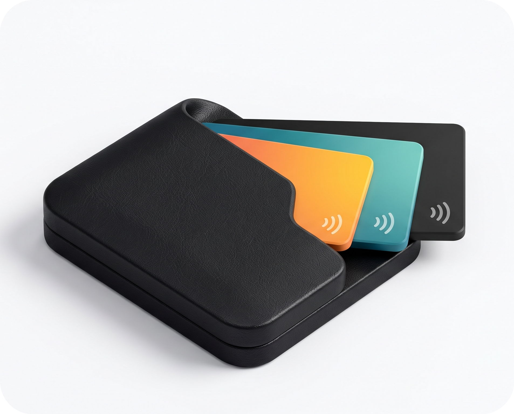

<div align="center">



# MyDompet

### Aplikasi Manajemen Keuangan Pribadi

<br/>

[](https://github.com/Faza01/MyDompet-Aplikasi-Manajemen-Keuangan-Pribadi/releases/latest)
[](https://github.com/Faza01/MyDompet-Aplikasi-Manajemen-Keuangan-Pribadi/releases)

<br/>

[**Unduh**](#unduh) · [**Fitur**](#fitur) · [**Cara Install**](#cara-install) · [**Disclaimer**](#disclaimer)

</div>

---

<div align="center">

<h1><a id="screenshots"></a>Screenshots</h1>


</div>

---

<div align="center">

<h1><a id="fitur"></a>Fitur</h1>

<table>
  <tr>
    <td width="50%" valign="top">

#### Pencatatan Transaksi
- Input transaksi instan berbasis teks maupun suara
- Deteksi otomatis kategori dan nominal
- Riwayat transaksi dengan navigasi halaman

</td>
    <td width="50%" valign="top">

#### Manajemen Dompet
- Kelola beberapa akun dompet atau rekening sekaligus
- Saldo gabungan lintas akun

</td>
  </tr>
  <tr>
    <td width="50%" valign="top">

#### Anggaran & Laporan
- Batas anggaran bulanan per kategori
- Visualisasi statistik dalam diagram pai dan diagram batang
- Rentang laporan harian, mingguan, bulanan, hingga tahunan

</td>
    <td width="50%" valign="top">

#### Data & Privasi
- Basis data tersimpan sepenuhnya secara lokal
- Ekspor dan impor data untuk cadangan

</td>
  </tr>
  <tr>
    <td width="50%" valign="top">

#### Antarmuka
- Desain modern minimalis

</td>
    <td width="50%" valign="top">

</td>
  </tr>
</table>

</div>

---

<div align="center">

<h1><a id="unduh"></a>Unduh</h1>

<table>
  <tr>
    <th align="center">GitHub</th>
  </tr>
  <tr>
    <td align="center">
      <a href="https://github.com/Faza01/MyDompet-Aplikasi-Manajemen-Keuangan-Pribadi/releases/latest">
        
      </a>
    </td>
  </tr>
</table>

</div>

---

<div align="center">

<h1><a id="cara-install"></a>Cara Install & Menjalankan</h1>

</div>

### Persyaratan
- Flutter SDK (versi `>=3.0.0`)
- Android SDK / Xcode untuk emulator atau perangkat fisik

### Langkah-langkah

1. Clone repositori:
   ```bash
   git clone https://github.com/Faza01/MyDompet-Aplikasi-Manajemen-Keuangan-Pribadi.git
   cd MyDompet-Aplikasi-Manajemen-Keuangan-Pribadi
   ```
2. Unduh dependensi:
   ```bash
   flutter pub get
   ```
3. Jalankan di mode debug:
   ```bash
   flutter run
   ```
4. Jalankan di mode performa tinggi (profile):
   ```bash
   flutter run --profile
   ```
5. Build APK rilis (split per ABI):
   ```bash
   flutter build apk --release --split-per-abi
   ```

---

<div align="center">

<h1><a id="disclaimer"></a>Disclaimer</h1>

</div>

MyDompet dikembangkan sebagai proyek pribadi untuk keperluan pembelajaran. Aplikasi ini tidak berafiliasi dengan, disponsori oleh, atau terhubung dengan pihak bank, lembaga keuangan, maupun penyedia layanan pembayaran mana pun.

Seluruh data yang dimasukkan pengguna disimpan secara lokal pada perangkat masing-masing. Kode sumber repositori ini bersifat *source-available* untuk tujuan edukasi dan referensi pribadi. Penyalinan, distribusi ulang, perubahan merek, maupun penggunaan untuk tujuan komersial tanpa izin tertulis dari pemilik repositori tidak diperkenankan.

---

<div align="center">

<br/>

**Dibuat oleh [Faza](https://github.com/Faza01)**

</div>